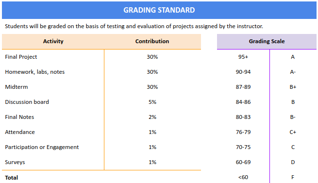

# Welcome to CIS-106-Linux Fundamentals
Here you will find all the information for the course.

## TABLE OF CONTENT
  - [COURSE LEARNING OUTCOMES](#COURSE-LEARNING-OUTCOMES)
  - [Requirements](#requirements)
  - [Resources](#resources)
  - [Presentations](#presentations)
  - [Labs](#labs)
  - [Homework](#homework)
  - [Discussion Topics](#discussion-topics)
  - [Final Project](#final-project)

## COURSE LEARNING OUTCOMES 
* Demonstrate fluency in Linux terminology.
* Install Linux and identify features of various distros.
* Manage files in the Linux environment.
* Administer user accounts and groups efficiently.
* Use Linux Utilities to manage data.
* Install software and third-party utilities.
* Managing Resources in the Linux networking environment.
* Understanding of virtualization with Virtualbox
* Understanding of Markdown and proper documentation techniques

# Requirements
---
* Access to a computer whrere Linux can be installed. The following are options:
  * A virtual machine (Prefered)
  * A laptop/Desktop computer that you can wipe.
  * A Raspberry Pi 4 or other capable single board computer
* Access to Blackboard
* A Github account
* A Text editor. We will be using [VS Code](https://code.visualstudio.com/) but you can use whatever you want
* How to install VS Code on Windows?
* How to install VS Code on macOS?
* How to install VS Code on Ubuntu?

# Resources
---
* [Virtual machine ready to use](https://linkhere.com)

:warning: **WARNING!** :warning:

 **This virtual machine does not have guest additions and must be updated right after importing**  
  * Snaphots:
    1. After installation and update
    2. After installation of basic software:
  * Virtual Machine Specs:
    * Hard drive:
    * RAM:
    * CPU:
    * Video Graphics:
    * Audio controller:
    * Network Card:
* **Books** 
  * [The Linux Command Line By William Shotts](https://bit.ly/34Og1Bp)
  * [Raspberry Pi Beginner's Guide 4th Edition](http://bit.ly/34QaA4O) 
  * [Free Linux Magazine with good command line reference](https://www.raspberrypi.org/magpi-issues/Essentials_Bash_v2.pdf)
  * [Free book. wont be used but it is good to have](http://www.it-docs.net/ddata/900.pdf)
  * [Raspberry Models Comparison](https://socialcompare.com/en/comparison/raspberrypi-models-comparison)
* **Github Markdown**
  * [Github Markdown Syntax Cheatsheet](https://guides.github.com/pdfs/markdown-cheatsheet-online.pdf)
  * [Github Markdown syntax official documentation](http://bit.ly/3pvKZpE) 
 
# Presentations
---
0. ## Lecture 0: Introduction to the course. 
  1. Where is the Syllabus? - In Blackboard
  2. How am I going to earn my grade 
   
   
  
  3. [How am I going to succeed in this class?](http://bit.ly/3pqo3bw)
  4. What is Git and Github?
  5. [Markdown Presentation](http://bit.ly/2KJyqbV)
  

1. ## Lecture 1: Introduction to Linux
   * [Introduction to Linux](http://bit.ly/3hmdLX6)
   * [What is Ubuntu?](http://bit.ly/2JrgKkA)

2. ## Lecture 2: Installing Ubuntu, Virtualization, and the Raspberry PI
* [The basics of Virtualization](http://bit.ly/2KIAlNA)
* [Using Virtualbox](http://bit.ly/3hk03nI)
* [Installing Ubuntu 20.04 in virtualbox](http://bit.ly/2WR4i0o)
* [What is a Raspberry pi?](http://bit.ly/3nXAP0P)

3. ## Lecture 3
4. ## Lecture 4
5. ## Lecture 5
6. ## Lecture 6
7. ## Lecture 7
8. ## Lecture 8
9. ## Lecture 9
10. ## Lecture 10
11. ## Lecture 11
12. ## Lecture 12
13. ## Lecture 13

# [Labs](labs/)
---

# Homework
---

# [Discussion Topics](discussion/)
---
1. Introduce yourself
2. Command Line Heroes
   * The history of Linux: 
     * [OS WARS PART 1](https://www.redhat.com/en/command-line-heroes/season-1/os-wars-part-1)
     * [OS WARS PART 2](https://www.redhat.com/en/command-line-heroes/season-1/os-wars-part-2-rise-of-linux)
     * [Heroes in the Bash Shell](https://www.redhat.com/en/command-line-heroes/season-3/heroes-in-a-bash-shell)
     * [Any Podcast from season 4](https://www.redhat.com/en/command-line-heroes/season-4)
3. [The Rise of Open-Source Software](https://www.youtube.com/watch?v=SpeDK1TPbew)
4. What is IoT (Internet of Things)?
   1. [What is IoT?](https://www.youtube.com/watch?v=6mBO2vqLv38)
   2. What are the dangers of IoT?
   * [Video 1](https://www.youtube.com/watch?v=vgoX_m6Mkko)
   * [Video 2](https://www.youtube.com/watch?v=pGtnC1jKpMg)     
5. [Linux is Freaking Weird](https://www.youtube.com/watch?v=xPbAXKMCDkY)

# [Final Project](finalProject/)
---
