# Topics to study for midterm

## What is Linux? 
Linux is a multitasking, multi user and multi purpose operating system.

## What is Ubuntu?
Ubuntu is a Linux distribution, freely available with community and professional support. 

## What is a Linux Distribution?
Any operating system that uses the linux kernel.

## Advantages and disadvantages of using Ubuntu
### Advantages
- software is generally available for free
- the user can modify the code
- General more reliable
- here is an [article](https://www.fossmint.com/advantages-ubuntu-has-over-windows) about it

### Disadvantages
- less hardware support than Windows
- can be risky
- less user friendly than Windows
- lack of corporate support.

## How to work with multiple terminal windows
- Snap one terminal to the right and another to the left
- Open multiple tabs

## How to use flameshot to highlight screenshots
- see the video in [youtube](https://www.youtube.com/watch?v=9OTEMrCzrQ8&t=60s)
## How to download files from the internet using wget.
- To download files with wget use the following formula: `wget + url`. **Examples from the labs:**
  - This example downloads the file lab4.zip then unzips the lab4.zip and then removes the lab4.zip file
    - ```wget https://robertalberto.com/public/lab4.zip && unzip lab4.zip && rm lab4.zip```

## How to download and run scripts using curl
- To download and run a script with curl use: curl + url | bash
  - This example downloads the script lab4.1.sh and then pipes it to bash for execution
    - ```curl https://robertalberto.com/cis106/lab4.1.sh | bash```

## How to use the following commands:
  * **mkdir**
    * used for making directories
    * formula: ```mkdir + option + directory name```
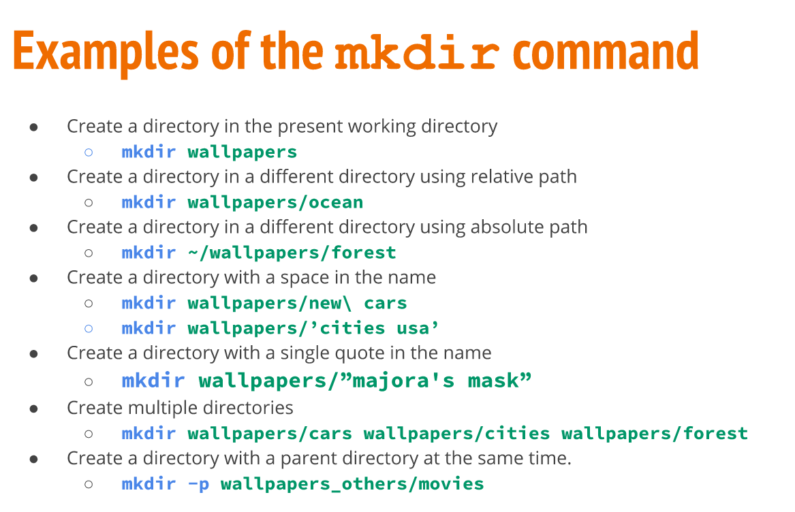<br>
* more examples in the [professors website](https://robertalberto.com/linuxcommands/commands/mkdir.html)
  * **tree**
    * used: for displaying a tree of a given directory. Similar to ls but more pretty!
    * formula: `tree + option + directory name or file`
    * common options of the tree command:
      * use command: `tree --help` or `man tree`

## How to create multiple files and directories using brace expansion
  * What is brace expansion? a feature to expand a command. For examplem, you can create multiple files or directories in a single command:
	* Examples:
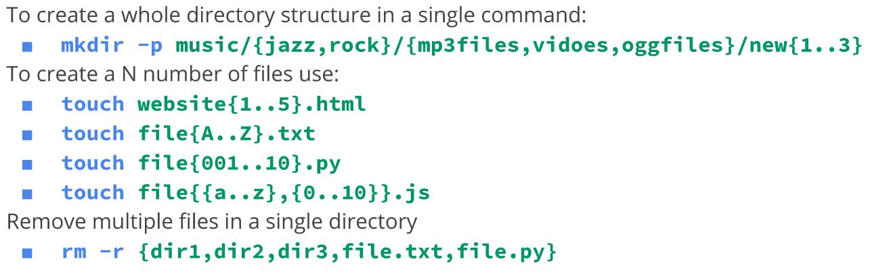<br>
* Examples from lab:
* Create the following directory structure:
```
wallpapers/
├── cars
│   ├── 1080p
│   ├── 2k
│   └── 4k
└── ocean
    ├── 1080p
    ├── 2k
    └── 4k
```
* Solution: `mkdir -p wallpapers/{cars,ocean}/{1080p,2k,4k}`

## How to move and remove files and directories using absolute and relative path
### Absolute path
* States the file name starting from the root (/). For example: `/home/user/Downloads/game.exe` is the absolute path of the game.exe file.
* Absolute path works from anywhere in the filesystem

### Relative path
* Specifies a pathname starting from the current working directory. For example, asuming that my pwd is home, the relative path of game.exe is `Downloads/game.exe`

### move a file
to move a file we use the mv command. The basic formula is: `mv + source + destination` where source and destination can be absolute path or relative path.
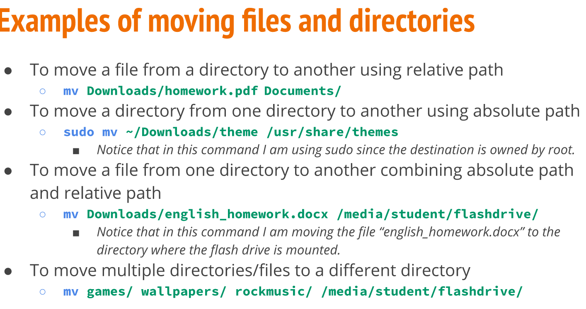<br>
* mv can also rename. the formula is the same. Example:
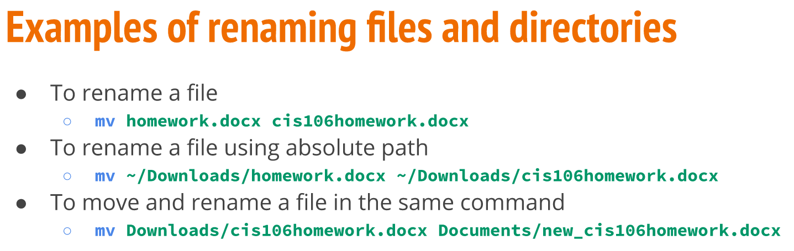

## How to move and remove directories using:
*  ~ is a shorthand for the currents user home directory.
   *  This pathname: `~/Downloads` is the same as `/home/user/Downloads`
* ../ represents one directory back. In otherwords, it can be used to navigate backwards. For example, if my pwd is `~/Downloads/games/fps` I can go back two directories to `~/Downloads` using `cd ../../`

## How to save the output of a command to a file
* to save the ouput of a command to a file use: `>` for example, to save the output of `ls ~/Downloads/games` to a file name `list-of-games.txt` use this command: `ls ~/Downloads/games > list-of-games.txt`

## How to append the output of a command to a file
* append means: add (something) as an attachment or supplement. To append the ouput of a command to a file that already has data in it use `>>` for example: 
<br>

## How to use basic commands (mkdir, mv, cp, ls) to organize files in directories and subdirectories
* mkdir = creates directories
* mv = moves and rename files
* cp = copies files
* ls = list files
Examples of these commands can be found here:
* [presentation managing files mv cp](https://docs.google.com/presentation/d/e/2PACX-1vRXQhdRviYicst8RhPxAcgQmj8-8YCuNSSy4NjmCv1ekxfQuI3KvDmdfuAztj1hbDo6dXPsuF8RezsZ/pub?start=false&loop=false&delayms=3000#slide=id.p)
* [presentation ls](https://docs.google.com/presentation/d/e/2PACX-1vSBCZX4zbvAKaBbEt7cBk68w04g-iZdJ0gCpH_7YE1IIr7EswY9bDbk0oT8z3iial96gTi8GuYArSFe/pub?start=false&amp;loop=false&amp;delayms=3000#slide=id.gbdd18af899_0_58)
* [professors website](https://robertalberto.com/linuxcommands/home.html)

## How to use vim to add text to a file
* [Presentation on vim](https://docs.google.com/presentation/d/e/2PACX-1vQOSwboIunBhoeFJ0UZrBdGYHC9I0MHEEzp_m68LWX2-G9fb-wHvCTL-MeZt10yTy1K-gsVrP2DHEHy/pub?start=false&loop=false&delayms=3000#slide=id.g84b12012da_0_0)
* [cheat sheet vim](https://vim.rtorr.com/)

## How to use grep to search for strings inside a file
* grep is a command used for matching strings:
* formula 1 working with a file: `grep + option + string to search + file`
* formula 2 working with a command output: `command output | grep + option + string to search`
* common options:
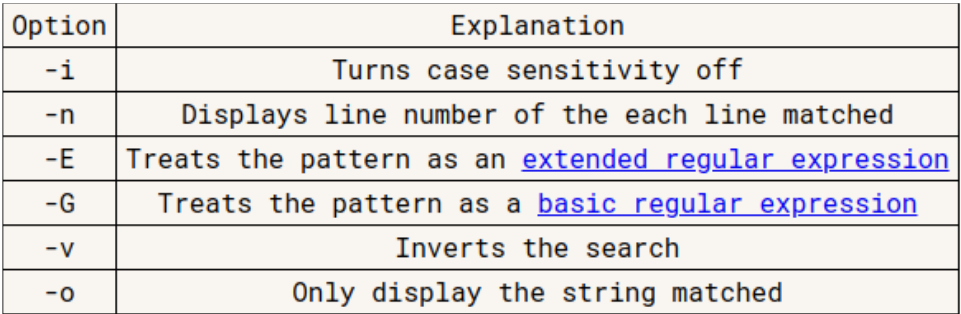<br>
* Examples of grep:
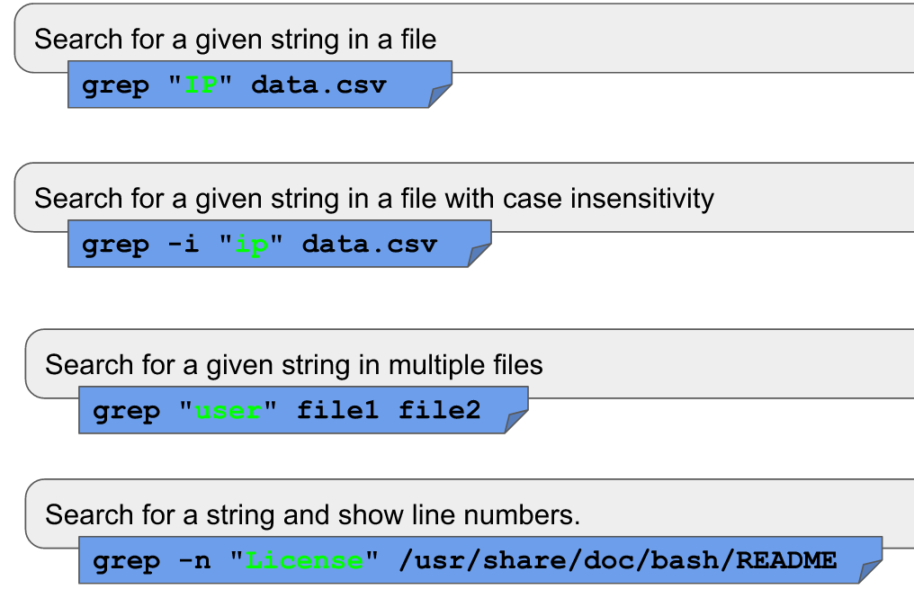<br>
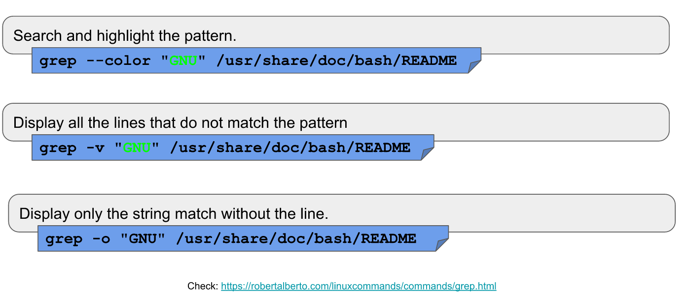<br>


## How to rename files and directories
* to rename files use the mv command:
* formula: `mv + current file name + new file name`
* Examples:
* 

## How to know the size of file
* The stat command can show this information. Example: `stat file`
* `ls -lh file` or `exa -l file` or `tree -h file` shows the file size with human readable format.
* if the file is a text file, a word count with wc does the job.
 
## How to use the cat command
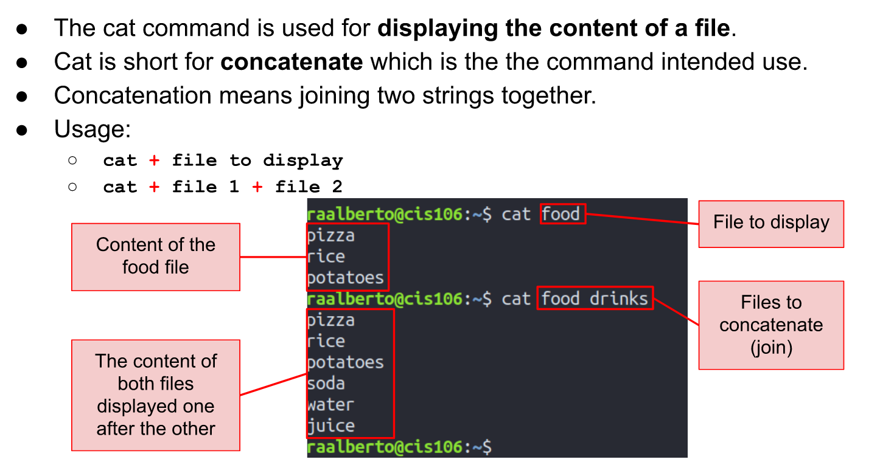<br>
* Examples:
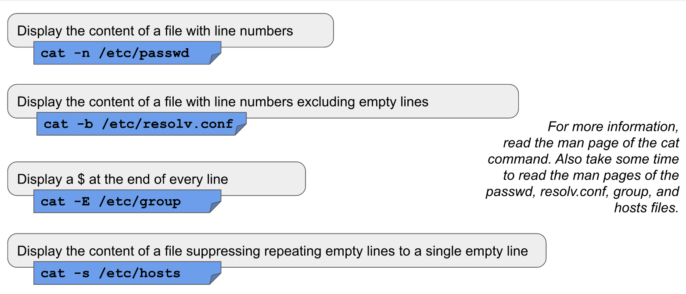<br>

## Difference between an absolute path and relative path
### Absolute path
* States the file name starting from the root (/). For example: `/home/user/Downloads/game.exe` is the absolute path of the game.exe file.
* Absolute path works from anywhere in the filesystem

### Relative path
* Specifies a pathname starting from the current working directory. For example, asuming that my pwd is home, the relative path of game.exe is `Downloads/game.exe`

## How to get the inode number of a file
* The stat command can show this information. Example: `stat file`
* `ls -i file` or `exa -i file` or `tree --inodes file` shows the file inode number.

## How to know when was a file last modified
* the `ls -l` or `stat` command provide this information.

## How to display the absolute path of a file
* ls + file using absolute path

## How to use the cut, head, and tail commands with the pipe to filter the output of a command
* [cheat sheet of head](https://robertalberto.com/linuxcommands/commands/head.html)
* [cheat sheet of tail](https://robertalberto.com/linuxcommands/commands/tail.html)
* [cheat sheet of cut](https://robertalberto.com/linuxcommands/commands/cut.html)
* **Head** = displays the first 10 lines of a file or a given number
* **Tail** = displays the last 10 lines of a file or a given number
* **Cut** = the cut command is used to extract a specific section of each line of a file and display it to the screen 
# the pipe
Allows you to send the output of a command as input to another command. Examples:
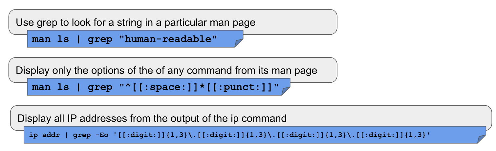<br>

## How to use wildcards to match specific file names: *,?,[],{}
* The * wildcard
  * matches anything and nothing - any number of characters.
  * Examples:
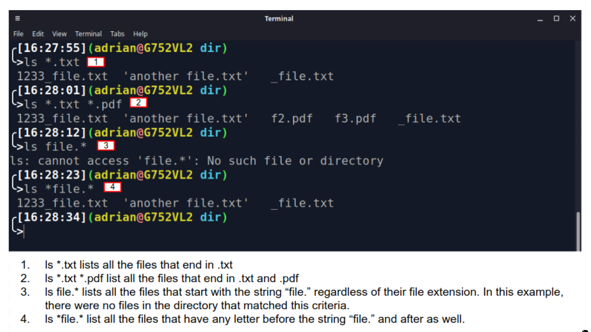<br>
* The ? wildcard
  * Matches only one character at a time.  
  * Examples:
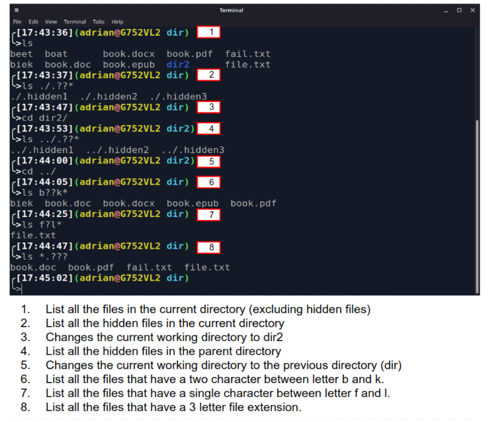
* The [] wildcard
  * Matches a single character in a range of characters
  * The ! mark is used to reverse the match. For example, match every letter except vowels `[!aoiou]`
  * Examples:
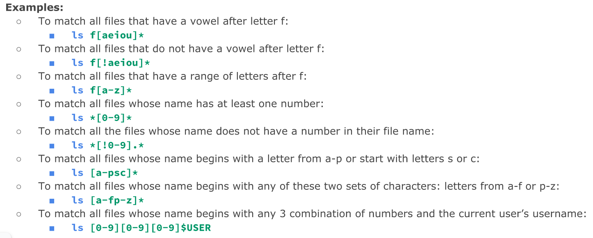<br>
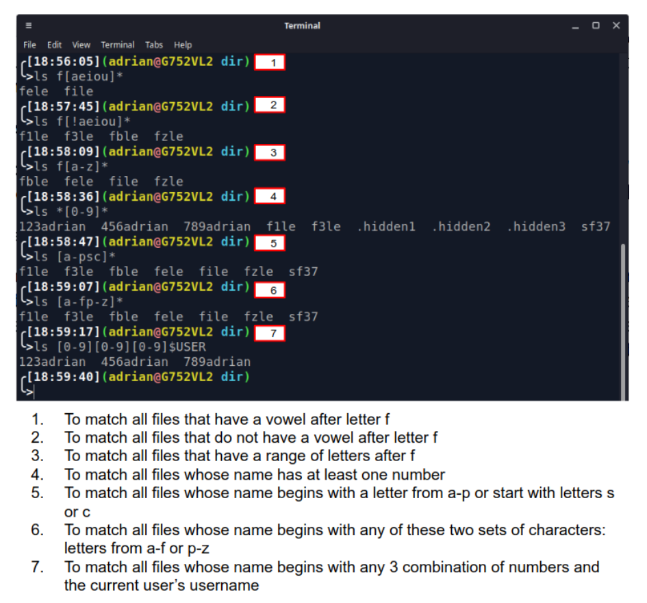<br>
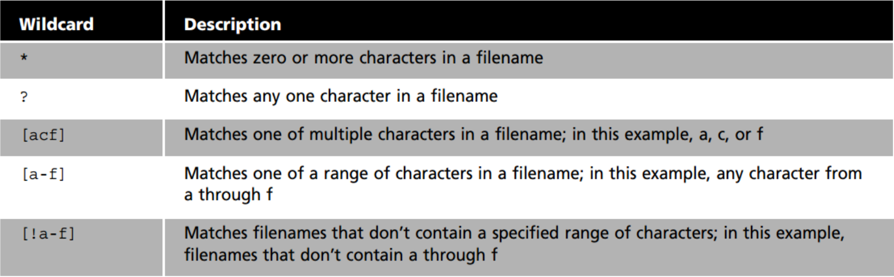
* {} Expansion
* What is brace expansion? a feature to expand a command. For example, you can create multiple files or directories in a single command:
	* Examples:
<br>
* Examples from lab:
* Create the following directory structure:
```
wallpapers/
├── cars
│   ├── 1080p
│   ├── 2k
│   └── 4k
└── ocean
    ├── 1080p
    ├── 2k
    └── 4k
```
* Solution: `mkdir -p wallpapers/{cars,ocean}/{1080p,2k,4k}`
  
## How to manage data with tar and compression tools
* Tar command examples:
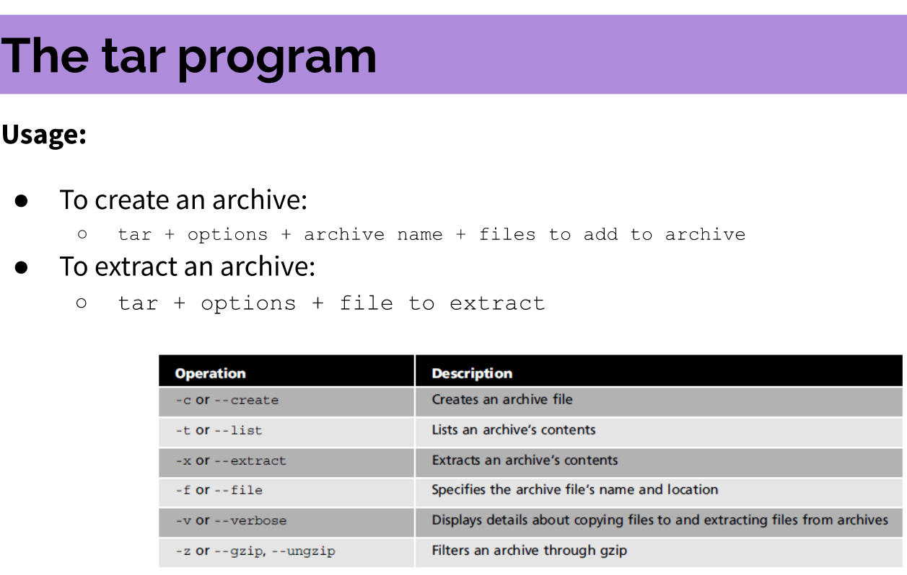
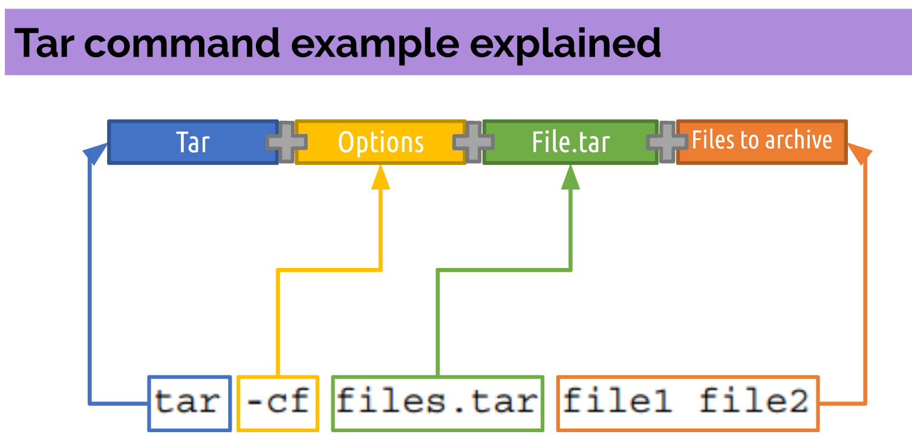
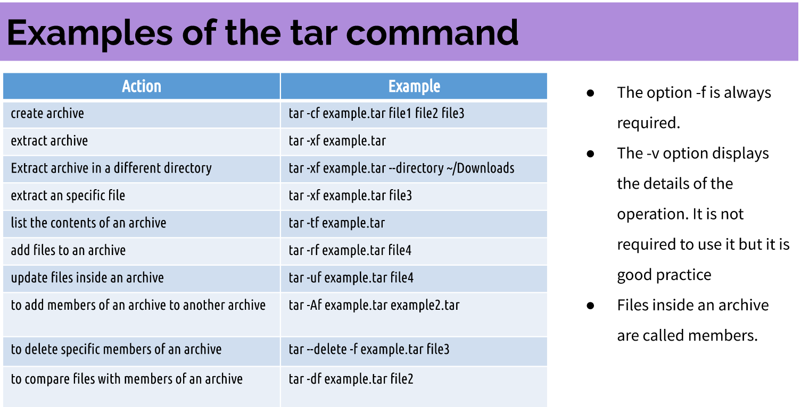

* Compression utilities:
  * The gzip, bzip2, and xz commands are used for compression.
  * Examples of file extensions:
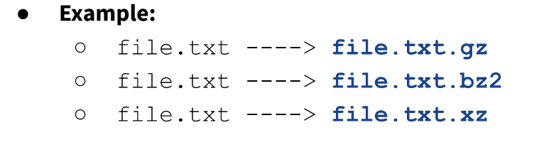

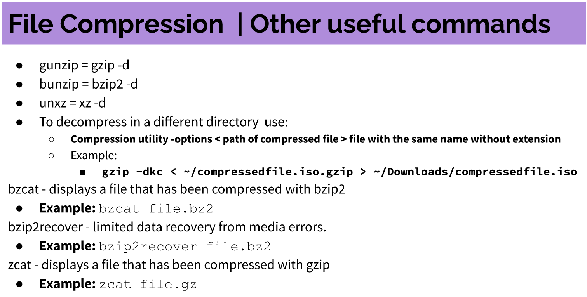