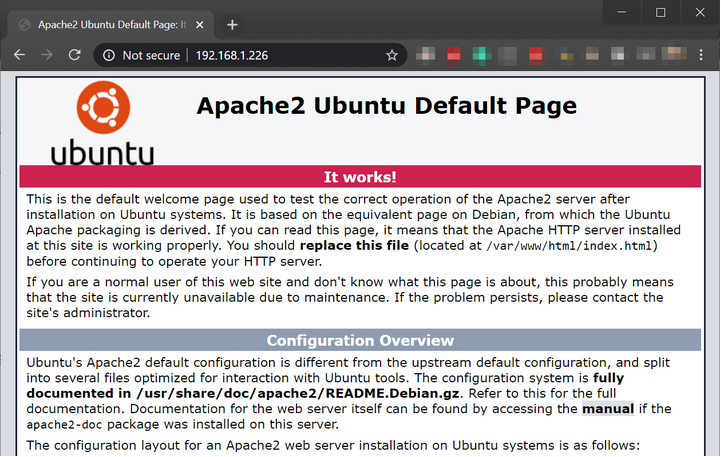

# Build a LAMP Stack

## Table of content here
- [Build a LAMP Stack](#build-a-lamp-stack)
  - [Table of content here](#table-of-content-here)
  - [Project Description](#project-description)
  - [Requirements](#requirements)
  - [Setting Up The Server Environment](#setting-up-the-server-environment)
    - [Virtual Machine Specifications](#virtual-machine-specifications)
    - [Configuring the server’s operating system](#configuring-the-servers-operating-system)
      - [Setting up UFW](#setting-up-ufw)
      - [Setting up SSH](#setting-up-ssh)
  - [Install The Software](#install-the-software)
    - [Apache](#apache)
      - [Useful systemctl commands](#useful-systemctl-commands)
    - [MySQL](#mysql)
    - [PHP](#php)
    - [PHPMyAdmin](#phpmyadmin)
  - [Project Code](#project-code)
  - [Difficulties Encountered](#difficulties-encountered)
  - [Work Cited](#work-cited)

## Project Description
In this project, I am creating a Web application hosted on a Linux server for logging my blood sugar (glucose) levels. The application must meet the following requirements:
* Must provide an input box for entering an integer value for the current glucose level.
* Every entry must be saved to a database including the time stamp
* Must provide a way to display a table of all the entries arranged by date and time 

## Requirements
The project requires the use of a LAMP Stack (Linux, Apache, Mysql, and PHP). I am using the following specifications:
* Linux Distribution: Ubuntu Server 20.04
* Web Server: Apache
* DBMS: MariaDB (from the standard software repositories)
* Php version: PHP 7

## Setting Up The Server Environment
### Virtual Machine Specifications
The virtual machine is built on HyperV in a Windows 10 Pro64 bit host. The host hardware specifications are:

The Virtual machine specifications are:
* RAM: 2GB
* CPU: 2 cores
* Network adapter: 1 NIC in Bridge configuration to make development easy

### Configuring the server’s operating system
After installing [Ubuntu Server](https://youtu.be/laQSC0KYWck) in the virtual machine, there are some configurations that need to be done before installing a web server and a database.  It is essential to set up a firewall so that only connections to certain services are allowed. Additionally, SSH needs to be set up so that a remote connection to the server can be performed. For this project, I have enabled ssh to use keys for authentication instead of the default username and password functionality. 
#### Setting up UFW
Ubuntu uses ufw (uncomplicated firewall) as the default firewall configuration tool for iptables. Ufw can block services by port, network interface, and IP addresses. The following commands are used to set it up:
* To check the firewall status:
`sudo ufw status`
* To list all applications that have register their profiles with UFW:
`sudo ufw app list`
* To enable/disable/reload the firewall
`sudo ufw enable|disable|reload`
* To allow SSH connections
`sudo ufw allow openssh`
* To block an IP address
`sudo ufw deny from 10.10.2.5`
* To allow/deny connections from a given port
``sudo ufw allow|deny 21`
* To allow/deny incoming HTTP requests
`sudo ufw allow|deny http`
* To allow/deny all incoming traffic from HTTP or https
`sudo ufw allow|deny proto tcp from any to any port 80,443`

For this project, It is necessary to make sure that the firewall is working and that at least for now ssh connections are permitted. To accomplish this use the following 1 liner: `
sudo ufw allow openssh; sudo ufw enable; sudo ufw status`

#### Setting up SSH
Before setting up SSH keys, it is important to make sure that a connection with only the username and password can be made. In Windows, you can use [Putty](https://bit.ly/32UtZl4) which is a free SSH and Telnet client, or If your Windows 10 host computer is updated to the latest version, you should be able to use OpenSSH in Powershell or the [Windows terminal.](https://bit.ly/39rB4L0) To connect to the virtual machine, all is needed is the IP address of the machine and making sure that the server has a network interface card in bridge mode. In Hyper-V, you need to [create a virtual switch](https://rapurl.live/p8w) and then assign the virtual switch to the NIC of the VM. In the virtual switch management dialog box, the new switch needs to be set to External Network, and Allow management of the OS to share the network adapter needs to be checked. 

To obtain the IP address of the server using any of the following commands:
* The hostname command will display all the IP addresses assigned to the host. `hostname -I`
* The ifconfig and ip commands are used for configuring network interfaces. Ifconfig is deprecated as it is part of the net-tools package. Ip is the command that replaces the ifconfig command. If the examples below do not work for you, use the ifconfig command or ip command without the pipes, and examine the output carefully.
  * `ifconfig | grep “inet” | head -1`
  * `ip addr | grep “inet” | head - 3 | tail -1`

To connect to the Ubuntu Server, in your Windows Terminal/Powershell type: 

`ssh your-username-in-the-server@ip-of-your-server`

You will be asked to provide the user’s password and after successfully entering it, you will be connected to the server from your host computer. Because connecting to the server will be a repetitive task, I have set up SSH keys so that I do not have to type a password to connect. To create an SSH key, type the following command on the machine that will be connecting to the server: 

`ssh-keygen.exe` 

The command will generate an ssh-key and it will store it in a dedicated directory. Once the 
key is generated, we need to copy it to the Ubuntu Server. Use this command to achieve this task:

`scp C:\Users\[username]\.ssh\id_rsa.pub your-username-in-the-server@ip-of-your-server:/home/username`

Once you have copied the SSH key, connect to the server one more time so that you can place the key in its appropriate directory. Use the following commands:

1. `ssh your-username-in-the-server@ip-of-your-server`
2. `cat id_rsa.pub >> .ssh/authorized_keys`

Now you should be able to connect to the server without the need of a password.

## Install The Software
### Apache
Apache HTTP Server is an Open Source and Free Software web server software available in Linux, Windows, macOS, Solaris, and BSD. To install Apache on Ubuntu use the following command:

`sudo apt install apache2`

Once Apache has been installed, it needs to be enabled and restarted. Enabling a service in a Linux System means that such service/daemon will run on startup. To enable and restart Apache use the following command:

`sudo systemctl enable apache2 && sudo systemctl restart apache2`

In the command above the Systemctl program is used for managing Systemd which is Ubuntu’s init system and service manager.  After enabling and restarting the Apache webserver service, it is required to allow HTTP/HTTPS traffic to the webserver. Use the following command to allow these connections through the firewall:

`sudo ufw allow in "Apache"`

To check if your Apache Web server is running, open a web browser and type your server’s IP address in the URL bar. If your server is running, you should see the page below. If your server is not running, you can use the Systemctl useful commands and Apache log files to find the root cause of the problem. Keep in mind that the server must be in the same network as the client machine from where you attempted to visit the server’s IP.

#### Useful systemctl commands
* To view active Systemd jobs:
`systemctl list-jobs`
* To view the default  run level:
`systemctl get-default`
* To stop a running service:
`systemctl stop  service-name-here`
* To start a service:
`systemctl start  service-name-here`
* To restart a running service:
`systemctl restart  service-name-here`
* To reload any service config’s file:
`systemctl reload  service-name-here`
* To see the status of a service:
`systemctl status  service-name-here`
* To enable a service on startup:
`systemctl enable service-name-here`
* To prevent a service from stating up at boot:
`systemctl disable  service-name-here`

Apache saves logs files in the directory `/var/log/apache2`. The apache2 directory contains 2 files: `access.log` and `error.log`. The access.log file stores information about requests coming into the web server. The error.log file stores information about errors the web server encountered when processing requests.  To review these log files, use the commands `cat`, `tac`, `head`, `tail`, and `grep`. You can find examples of these commands in my [website](https://bit.ly/2CZZks0). 

Another useful tool when troubleshooting issues with logs is the program `Journalctl`. Journalctl is used for querying and displaying logs from journald, systemd’s logging service. Without any argument, journalctl returns the full contents of the journal, starting with the oldest entry collected. Journalctl is efficient in outputting logs in multiple formats, for example, the following command will show Apache logs formatted in JSON:
`journalctl -u apache2.service -r -o json-pretty`

### MySQL 
To install MySQL in Ubuntu use the following command: `sudo apt install mysql-server`. After installing mysql-server, it is vital to run mysql_secure_installation to remove some insecure default settings and lock down access to the database. 
`sudo mysql_secure_installation`

 
### PHP
PHP is an open-source general-purpose scripting language for the web. PHP was invented by Rasmus Lerdorf in 1994. In PHP, different from JavaScript, the code is executed on the web server and then the client receives the result of the execution in HTML.  To install PHP in Ubuntu Server run the following command:

`sudo apt install php libapache2-mod-php php-mysql`

To test if PHP has been installed and it is running correctly, we can build a simple PHP page that will show the information about your PHP installation. First, make a backup of your index.html page then create a file called index.php and in it, type `<?php phpinfo(); ?>`.

### PHPMyAdmin
Since PHP is a server-side programming language, it is useful when dealing with databases. However, managing databases via the command line can easily become a cumbersome chore. PHPMyAdmin is a web-based client that allows developers to manage databases with a simple to use interface.  You can use phpMyAdmin to perform most administration tasks, such as creating a database, running queries, and adding user accounts. Before installing PHPMyAdmin, log in to your database, and check the password validation policy. The PHPMyAdmin installer will ask you for a password that matches the validation rules. Here is an example of how it looks:

To install PHPMyAdmin use the following command: `sudo apt install phpmyadmin php-mbstring`

The PHPMyAdmin installer will ask you for several questions. Each prompt has a description of what is being asked therefore it is pivotal to read everything. Here are the questions and the answers I used:

* **Web server to reconfigure automatically:** Apache (make sure to hit the space bar to select)
* **Configure database for phpmyadmin with dbconfig-common?** Yes
* **Connection method for MySQL database of phpmyadmin:** Unix Socket
* **Authentication plugin for MySQL database:** Default
* **MySQL database name for phpmyadmin:** it640project
* **MySQL username for phpmyadmin:** robert@localhost
* **Password:** Project640!

> **Note:** if you encounter the error: 1819 (HY000) do not disable the validate_password plugin, instead, ignore the error and after PHPMyAdmin finishes installing, log into the database and run the create user command with a password that meets the policy.
Here is an example:`CREATE USER 'robert'@'localhost' IDENTIFIED BY 'Project640!'; 
FLUSH PRIVILEGES;`

To test PHPMyAdmin, go to your web browser and type the username and password you created:

## Project Code

Once the system is configured and all the software is installed. I proceeded to write the base of the code. The first part is to write a basic HTML form where the user can enter the Glucose number and select the time and day. The HTML is then connected to a PHP script that sends the imputed data into the database. Once the data is in the database, the script runs another query to show all the values that have been entered so far. 
You can download a copy of the source code here: https://robertalberto.com/it640.tar  

## Difficulties Encountered 

**MySQL Validate Password Plugin Issue:**
During the installation of PHPMyAdmin, I came across a problem with the password validation plugin used by MySQL. Regardless of the password chosen, the phpmyadmin installer kept rejecting it. Online I found several solutions that involved uninstalling the plugin, changing the password policy, and creating another user that matches the policy exactly. None of these were viable solutions in my case. I solved this problem by first purging the PHPMyAdmin packages and dependencies, then I logged in to MySQL and created a user. In the installer, I chose to not ignore the problem and then log in to MySQL again and change the password of the newly created user. This user was then given full access to the database and I was able to continue with the project.

**PHP Error 500 issue Server could not process request**
While creating the PHP script I kept making syntax mistakes that were not obvious at the time. For instance, misspelling mysqli_connect, using double quotes in the _POST array and forgetting the $ at the beginning of the variable declaration. I decided to enable logging so that I can be aware of when I make these types of mistakes. This helped me out tremendously and I was able to get back on track quickly. 

## Work Cited
DigitalOcean. “UFW Essentials: Common Firewall Rules and Commands.” DigitalOcean, DigitalOcean, 18 Sept. 2019, www.digitalocean.com/community/tutorials/ufw-essentials-common-firewall-rules-and-commands. 

“Log Files.” Log Files - Apache HTTP Server Version 2.4, httpd.apache.org/docs/2.4/logs.html  

“Systemd Cheat Sheet.” Linux Training Academy, www.linuxtrainingacademy.com/systemd-cheat-sheet/.  

“Using Journalctl - The Ultimate Guide To Logging.” Log Analysis | Log Monitoring by Loggly, 13 Aug. 2019, www.loggly.com/ultimate-guide/using-journalctl/.

“What Is PHP?” Php, www.php.net/manual/en/intro-whatis.php. 