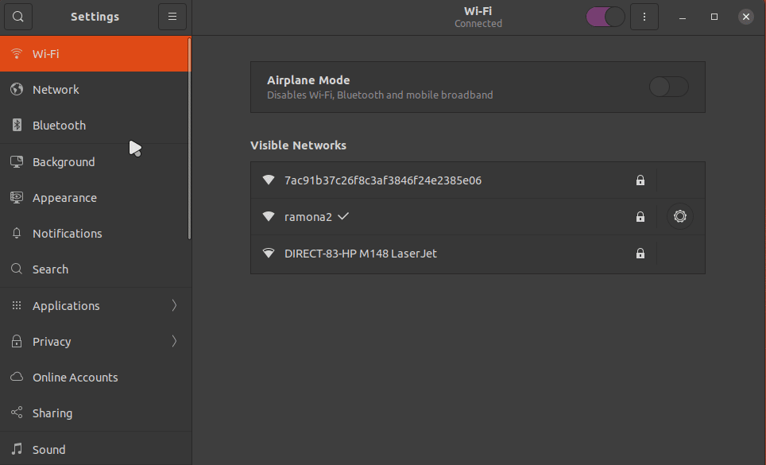

# Raspberry Pi Ubuntu 20.10 Setup **(Gnome 3 Edition)**

# Table of content
- [Raspberry Pi Ubuntu 20.10 Setup **(Gnome 3 Edition)**](#raspberry-pi-ubuntu-2010-setup-gnome-3-edition)
- [Table of content](#table-of-content)
    - [1. Update the system:](#1-update-the-system)
    - [2. Install the necessary software:](#2-install-the-necessary-software)
    - [3. Remove non-essential software:](#3-remove-non-essential-software)
    - [4. Enable Gnome Extensions:](#4-enable-gnome-extensions)
    - [5. Disable Animations](#5-disable-animations)
    - [6. Turn off desktop icons](#6-turn-off-desktop-icons)
    - [7. Remove the frequently used program from gnome shell](#7-remove-the-frequently-used-program-from-gnome-shell)
    - [8. Tweak Dash to Panel](#8-tweak-dash-to-panel)
    - [9.  VS Code Extensions:](#9--vs-code-extensions)
    - [10.  Replace Screenshot tool:](#10--replace-screenshot-tool)
    - [11.  Extra (non-essential) customization](#11--extra-non-essential-customization)

**Description:**
This is a guide to make Ubuntu 20.10 more efficient so that it consumes less resources.The version of the Raspberry Pi used to complete this guide was: Raspberry Pi 400, 4 (2GB, 4GB, and 8GB). **No Overclock!**
This guide is for those taking CIS-106 Linux Fundamentals and wish to use a Raspberry Pi over a Virtual Machine as their learning environment.

There is a version of this guide using [Gnome classic](pi-ubuntu-gnome-classic.md) for those who want to use Gnome Classic over Gnome 3.

### 1. Update the system: 
Before installing any software, make sure the system is update with: 

`sudo apt update; sudo apt upgrade -y;`

### 2. Install the necessary software:
These are the applications that are not installed by default but that are needed for our day to day work on the pi. These applications are not essential, THIS IS AN OPINION! Ubuntu is ready to use out of the box!

`sudo apt install gcc make perl nemo ubuntu-restricted-extras ubuntu-restricted-addons git python3-pip flameshot pandoc vlc gnome-tweaks curl snapd flatpak gnome-software-plugin-flatpak gnome-software-plugin-snap wget tree htop net-tools vlc peek vim deluge geany tilix neofetch midori -y`

>**VS Code:**
>
>Download deb package from: *https://code.visualstudio.com/sha/download?build=stable&os=linux-deb-arm64*
>2. Run this command (assuming that you downloaded the file to your Downloads directory) 
>**`sudo apt install $HOME/Downloads/code*.deb`**

### 3. Remove non-essential software:
The command below will remove some applications that I have no need for. This step is optional since you may find some use for these apps. However, you want to make sure that you remove irqbalance since it does not help the Raspberry Pi CPU.

`sudo apt purge apport irqbalance aisleriot gnome-mahjongg gnome-sudoku gnome-mines thunderbird transmission-common  -y`

>**Explanation:**
>* `apport`: package that does error reporting.
>* `irqbalance`: It is useless in the Raspberry Pi.
>* `aisleriot gnome-mahjongg gnome-sudoku gnome-mines`: office games. I dont play them so I dont need them.
>* `thunderbird`: Mozilla email client that I do not use so I don't need.
>* `transmission-common`: I do not use trasmission. I use deluge so I remove it.

### 4. Enable Gnome Extensions:
The default Gnome 3 DE is too heavy for the Raspberry Pi. Thankfully there are extensions that we can use to remove/improve the performance of Gnome 3 on the Pi.
* Go to: https://extensions.gnome.org/ click on `Click here to install Gnome Extensions`. Install the following extensions:
   1. **Dash to panel:** will move the favorite bar to the bottom and turn it into a panel.
   2. **caffeine:** will allow us to prevent the screen from locking.
   3. **Blur my shell:** (Not essential!) It blurs the wallpaper when you open the activities menu.
   4. **cpufeq by konkor:** will allow us to set a minimum frequency to all cores in the Pi
      1. Increase the minimum frequency to 1Ghz
      2. Disable splash screen

###  5. Disable Animations
Animations make the system slower. Less effects = faster system.
   1. Tweaks -> General -> Animations -> Off
   2. Tweaks -> Suspend laptop lid -> Off (We are not using a laptop)

### 6. Turn off desktop icons
I do not use desktop icons but if you do, keep this option on.
   1. Extensions -> Desktop icons -> Off

### 7. Remove the frequently used program from gnome shell
By default, Gnome 3 keeps the frequently used apps in the menu. This is not very useful to me but if it is useful to you, keep it!

`gsettings set org.gnome.desktop.privacy remember-app-usage false`

### 8. Tweak Dash to Panel
There are a couple of things that we need to do to make our experience better. Open the extensions manager app and then open the settings of **Dash to Panel**
   1. Under Position
      * Replace Applications Button with [Ubuntu logo](https://assets.ubuntu.com/v1/29985a98-ubuntu-logo32.png). this is not important, I just prefer the Ubuntu logo over the dots!
   
   2. Under Styles
      * Reduce the panel size to 32 or any number that works better for you.
      * Reduce Icon Margin to 4 or any number that works better for you.
      * Set Icon padding to 2 or any number that works better for you.
      * Enable Panel background opacity if you want to change the opacity of the panel. I like full transparent.
   
   3. Under Behavior
      * **Disable:** Show favorite applications on secondary panels
      * **Disable:** Show window previews on hover
      * **Enable:** Ungroup applications
        * Set Maximum width to 50
   
   4. Under Fine-tune:
      * **Disable:** Animate switching applications and animate launching new windows
      * Remove all favorite apps and add *Tilix, VS Code, and Firefox, and nemo*
   
### 9.  VS Code Extensions:
   * Live Server
   * Markdown All in one
   * Markdown Preview Enhanced
   * Markdown PDF
   * Markdown TOC
   * PDF Preview
   * Code Spell Checker

### 10.  Replace Screenshot tool:

### 11.  Extra (non-essential) customization
These steps are optional.

**Enable Dark Theme**
* Settings -> Appearance -> Dark 

**Install cursor themes:**
* [Materia Light Cursor theme](https://www.gnome-look.org/p/1346778/)
* [Layan](https://www.gnome-look.org/p/1365214/)

**Install Powerline:**
Just run this script if you want to prompt to look like this:
* https://raw.githubusercontent.com/ra559/cis106/main/powerlineinstaller.sh

